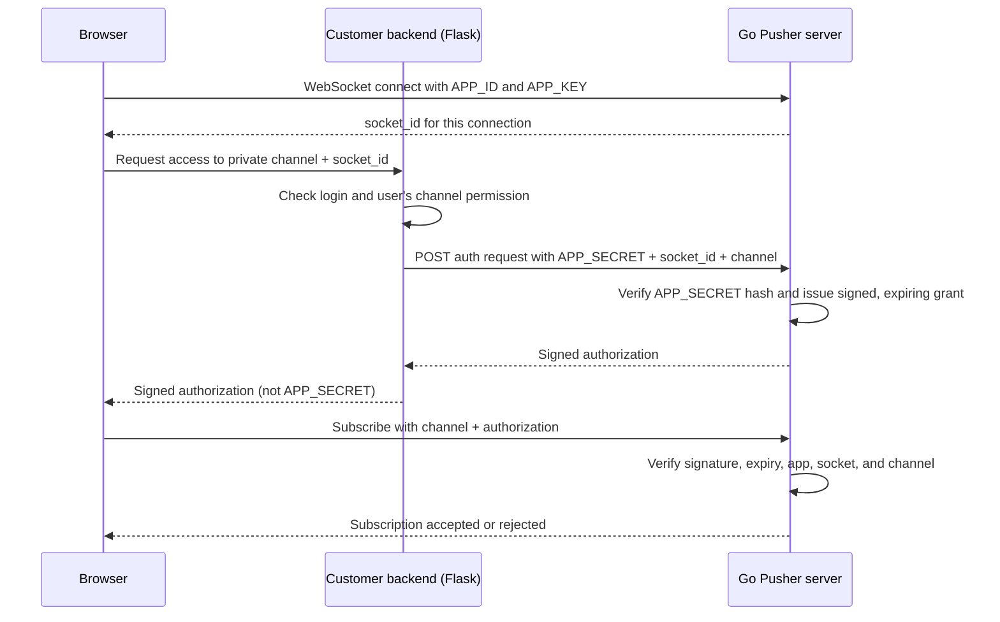

# Private-Channel Authentication

**Status: implemented baseline.** The Go server now issues short-lived JWT
grants for private channels, and the Flask example provides user registration,
login sessions, login gating, and a CSRF-protected authorization route.
Presence channels, production user permissions, and grant revocation are still
future work.

This guide explains the implementation. It remains intentionally separate from
presence channels: first make private subscriptions reliable, then extend the
same authorization flow for presence.

For the details of credential generation, JWT signing, and verification, see
[credentials-and-signing.md](credentials-and-signing.md).

## The Basic Idea

An app key identifies an app. It does **not** prove that a particular user is
allowed to read a channel. For a private channel, the customer's backend must
check the signed-in user's permission before Go accepts the subscription.

The browser never receives the app secret. Flask checks the user session and
asks Go to issue a short-lived authorization. Go validates Flask's app secret
using its stored hash, then signs a grant using a separate Go-only signing key.



The signed grant is not itself proof that the user logged in. Go trusts Flask to
make that decision because Flask authenticated with the app secret. Never put
that secret in browser JavaScript, HTML, or a URL.

## Why Go Signs the Grant

A common design is for Flask to HMAC-sign the channel authorization with the app
secret. Go would then need the original secret to verify that signature, but a
one-way hash cannot be used to recreate an HMAC key.

Instead, use two separate checks:

1. **Flask to Go:** Flask sends the app secret over HTTPS. Go checks it with
   `Registry.HasSecret`, which compares its hash with the submitted secret.
2. **Go to browser:** Go signs a short-lived grant with a different key stored
   only in Go's environment, for example `CHANNEL_AUTH_SIGNING_KEY`.

This lets Go keep using a one-way app-secret hash for verification. The signing
key must be a long, randomly generated value and must never be sent to Flask or
the browser.

## Proposed Request Flow

### 1. Open a WebSocket

The browser connects to the existing endpoint with the public app credentials:

```text
GET /apps/{app_id}/ws?key={app_key}
```

Go generates a random `socket_id` for each connection and sends it to the
browser in a connection-established message. The socket ID identifies this
particular live connection; it is not a user ID or a secret.

### 2. Ask Flask to authorize the user

When the user wants to subscribe to `private-orders`, the browser calls the
Flask route:

```text
POST /api/private-channel-auth
```

The request includes the `socket_id` and channel. The browser's normal Flask
session cookie identifies the signed-in user. Flask must check both that the
user is logged in and that they are allowed to access that channel. If not, it
returns `401 Unauthorized` or `403 Forbidden` and does not ask Go for a grant.
Because the route authenticates with a session cookie, protect it against CSRF.

The app secret is configured in Flask's environment. The route uses it in a
server-to-server request to Go; it does not accept a secret from the browser.

### 3. Have Go issue a signed grant

A proposed Go endpoint is:

```text
POST /apps/{app_id}/private-channel-auth
Authorization: Bearer {APP_SECRET}
Content-Type: application/json

{
  "socket_id": "socket-unique-id",
  "channel": "private-orders"
}
```

Go should:

- Check the app secret with `Registry.HasSecret`.
- Require a `private-` channel name and a non-empty socket ID.
- Verify that the socket ID belongs to a currently connected socket for this app.
- Sign claims containing `app_id`, `socket_id`, `channel`, and `exp` (expiry).
- Return the signed grant to Flask, which passes it to the browser.

Use a maintained JWT package rather than designing a token format by hand. If
using HMAC JWTs, configure validation to accept only the expected algorithm and
use a dedicated `CHANNEL_AUTH_SIGNING_KEY`; do not reuse an app secret for token
signing. A short lifetime such as 30 seconds limits how long an unused grant can
be replayed.

### 4. Require the grant during subscribe

The browser sends a WebSocket command like:

```json
{
  "action": "subscribe",
  "channel": "private-orders",
  "auth": "signed-grant-from-flask"
}
```

Go verifies the signature and expiry, then checks that the grant's app ID,
socket ID, and channel exactly match the active connection and requested
subscription. Only then should Go add the client to that channel in the hub.
A grant for one socket or channel must not authorize another one.

The grant expiry limits the time to start a subscription. It does not
automatically disconnect a client that was already subscribed. If subscriptions
must expire or be revoked while a socket stays open, Go will also need a lease,
renewal, or explicit revocation mechanism. A grant can also be replayed for the
same socket and channel until it expires. Preventing even that requires a
one-time grant ID and server-side tracking of consumed IDs.

## Configuration

Set `CHANNEL_AUTH_SIGNING_KEY` in the Go environment. This is a long random key
used only by Go to sign grants. Private authorization returns `503` when this
setting is absent; public channels continue to work.

The Flask example uses these settings from `clients/flask_app/.env`:

- `APP_ID`, `APP_KEY`, and `APP_SECRET` identify the registered Go app.
- `FLASK_SECRET_KEY` signs Flask login sessions.
- `USER_DB_PATH` selects the local SQLite database for demo users.

## Manual Test Plan

Run the Go server in terminal 1. The signing key is required for private
channels; use a different random value in a real environment.

```sh
cd /path/to/go-pusher
export CHANNEL_AUTH_SIGNING_KEY="local-test-signing-key-change-me"
go run .
```

### 1. Register an app

Open <http://localhost:8080>, register an app, and copy its **ID**, **key**, and
**secret**. Alternatively:

```sh
curl -X POST http://localhost:8080/apps \
  -H "Content-Type: application/json" \
  -d '{"name":"private-channel-test"}'
```

Keep the returned secret. It is needed by Flask, but must never be pasted into
browser JavaScript or sent in a WebSocket command.

### 2. Configure and run Flask

In terminal 2:

```sh
cd /path/to/go-pusher/clients/flask_app
cp .env.example .env
```

Edit `.env` with the credentials from step 1. Then run:

```sh
python3 -m pip install flask requests
set -a
. ./.env
set +a
python3 app.py
```

Open <http://localhost:5000>. This is the public-channel page. It does not
require login.

### 3. Test user login

1. From the public page, click **Go to private channel**.
2. Confirm Flask redirects you to `/login?next=/private`.
3. Register a user with a password of at least 8 characters.
4. Confirm Flask redirects you to `/private` after registration.
5. Click **Logout**, then open `/private` directly and confirm it redirects to
  `/login` again.
6. Log in again before testing a private channel.

The demo stores users in the SQLite file configured by `USER_DB_PATH`.
Passwords are stored as hashes, not plaintext.

### 4. Test a public channel

Stay on the root page and use channel `notifications`:

1. Click **Connect & subscribe**.
2. The message list should show a connection and subscription.
3. Publish an event from the same page.
4. The subscribed connection should receive the event.

This confirms the existing app-key, WebSocket, publish, and broadcast paths.

### 5. Test an authenticated private channel

After logging in, use the `/private` page and channel `private-orders`:

1. Click **Connect & subscribe**.
2. Go sends a `connected` message containing a `socket_id`.
3. The browser calls Flask's `/api/private-channel-auth` endpoint.
4. Flask checks the session and CSRF token, then calls Go with the app secret.
5. Go returns a short-lived JWT grant and the browser sends it with the
   subscribe command.
6. The message list should show `Subscribed to private-orders`.
7. Publish an event and confirm it is received on the private channel.

The browser may receive the signed grant, but it must not receive `APP_SECRET`.
Inspect the rendered page or browser network responses and confirm the literal
secret is absent.

### 6. Test rejection cases

Check each result:

- Log out and try `private-orders`: Flask should return `401 login is required`.
- Remove `X-CSRF-Token` in a request: Flask should return `403 invalid CSRF token`.
- Use a public channel without login: it should still work.
- Stop Go or use an invalid Go URL: Flask should return a connection error,
  not a successful authorization.
- Restart Go without `CHANNEL_AUTH_SIGNING_KEY`: public channels should work,
  but private authorization should return `503`.
- Change the grant's channel or socket ID before sending the subscribe command:
  Go should reject the subscription.
- Wait more than 30 seconds before using a grant: Go should reject the expired
  authorization.

### 7. Run automated checks

From the repository root:

```sh
go test ./...
python3 -m py_compile clients/flask_app/app.py
git diff --check
```

The Go auth tests cover valid, expired, and wrong-channel grants. The Flask
flow can be tested with its Flask test client using a temporary `USER_DB_PATH`.

### What is not tested yet

The demo currently lets any logged-in user request any `private-*` channel.
Production code should add an application-specific permission check between
login and the request to Go. Presence channels, user member data, revocation,
and one-time grant IDs are also not implemented yet.

## Terms

- **App key:** Public identifier used by a browser to connect to the correct
  app. It is not user authentication.
- **App secret:** Private credential Flask uses to prove it is the registered
  app's backend when requesting authorization from Go.
- **Socket ID:** Random identifier for one active WebSocket connection.
- **Grant:** Short-lived, Go-signed authorization for one app, socket, and
  private channel.
- **Presence channel:** A private channel that additionally shares authorized
  member identity and tracks who is present. It builds on the same grant checks.
